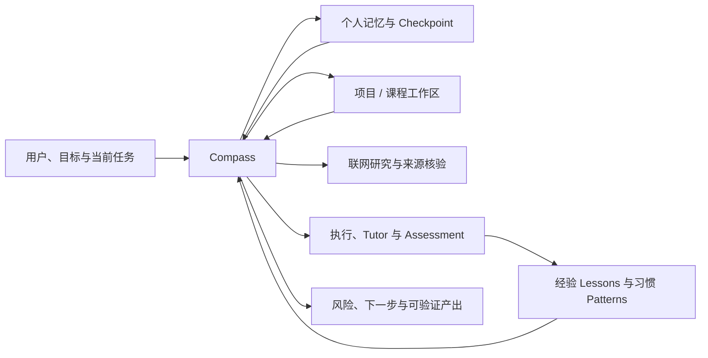

# Compass

> 一个面向个人长期协作的通用 AI Agent Skill：让 Agent 能够恢复记忆、延续项目、沉淀修复经验、适配用户习惯、联网核验信息，并在有证据时主动指出风险与下一步。

[](LICENSE)
[](SKILL.md)
[](SKILL.md)

Compass 不是一次性的问答提示词，也不只是大学生成长或期末复习工具。它是一层可复用的个人 Agent 协作协议：使用宿主已有的文件、搜索、推理、执行、日历和自动化能力，把不同会话、项目和长期目标连接成可以恢复、验证和继续的工作闭环。

全专业大学生成长、Tutor、Assessment、职业规划和资料文件夹 Final Review 是 Compass 已内置的场景模块；它们是完整能力的一部分，而不是产品边界。

> 为兼容已有安装和调用，Skill ID 暂时保留为 `$compass-student-growth`。展示名称、触发范围和实际工作流已经升级为通用 Compass。

## 能力全景

| 能力层 | Compass 的实现 | 关键边界 |
|---|---|---|
| Agent Memory | 个人文件持久记忆、checkpoint、跨会话和跨项目恢复 | 只有成功写入并回读后才声称已保存 |
| Self-Improving Agent | 沉淀问题、根因、有效修复、验证证据和预防检查 | 未验证猜测不能升级为长期规则 |
| Capability Evolver | 学习用户的稳定表达、工作、学习和代码习惯 | 单次行为仅为观察；当前指令永远优先 |
| Agent Browser | 按需搜索官方文档、论文、规则、项目与最新资料 | 无浏览工具时明确降级，不伪造联网结果 |
| Proactive Agent | 发现 deadline、重复阻塞、性能风险、技术债和目标偏离 | 只给少量有证据的建议，不假装后台监控 |
| Cross-Project Continuity | 记录工作区、规则、checkpoint 和可迁移经验 | 项目事实与临时 workaround 不跨项目污染 |
| Evidence & Assessment | 区分自述、文本、作品、验收和外部验证 | 用户说“做了”不等于已经验证 |
| Scenario Modules | 大学生成长、Tutor、职业规划、Final Review 等 | 场景按需加载，不限制通用 Agent 能力 |

## 统一工作闭环

Compass 不堆叠互相竞争的 Brain 或第二套 Agent Pipeline。所有能力都进入同一条流程：

```text
SAFETY → RESTORE → UNDERSTAND → DECIDE
→ EXECUTE → LEARN → PERSIST → RESPOND
```



## 1. Agent Memory：个人永久记忆

Compass 把本地文件作为跨会话状态的权威来源，而不是依赖模型上下文本身。

默认个人档案：

```text
~/.compass/users/<profile-id>/
├── MEMORY.md
├── profile.md
├── goals.md
├── preferences.md
├── competencies.md
├── evidence.md
├── lessons.md
├── patterns.md
├── workspaces.md
├── checkpoints/
│   ├── latest.md
│   └── previous.md
└── sessions/
```

旧版 `~/.compass-student-growth/` 档案继续兼容：新路径不存在而旧档案存在时优先恢复旧数据，并由用户决定是否迁移，避免产生两份分叉记忆。

每次新会话优先恢复 `MEMORY.md`、最新 checkpoint 和当前工作区，再按任务读取相关目标、证据、经验或习惯；不会把全部历史对话塞回上下文。

“永久”在这里指可验证的文件持久化：只要目录仍存在且 Agent 有读取权限，就可以跨会话恢复。文件被删除、设备损坏，或迁移时没有复制记忆目录，则不能保证恢复。Compass 不会宣称模型拥有物理意义上的无限记忆。

## 2. Self-Improving Agent：从修复中学习

当错误被复现、修复并验证后，Compass 可以把经验写入 `lessons.md`：

```text
问题与触发条件
→ 根因或待验证假设
→ 有效修复
→ 测试 / 验收证据
→ 适用与不适用范围
→ 下次执行的预防检查
```

再次遇到相似任务时，先检查上下文是否匹配，再复用经验。这样实现“同一个坑尽量不踩第二次”，同时避免把一个项目的特殊 workaround 误用到所有项目。

Compass 不会偷偷改写自身安全规则、用户事实或项目规则；未经验证的解释只能作为 hypothesis。

## 3. Capability Evolver：适配用户习惯

Compass 可以逐步学习并适配：

- 用户喜欢简洁还是详细的表达；
- 计划需要按天、按周还是按 milestone 展开；
- 偏好的学习方式、练习形式和提示强度；
- 项目中的命名、格式、代码风格与验证深度；
- 用户确认的长期工作约束与协作方式。

单次行为只记为 `observed`；用户明确确认，或多个场景反复出现后，才能提高为稳定模式。用户本轮指令、当前项目规则和现有代码风格始终高于历史偏好。

## 4. Agent Browser：连接外部信息

当问题涉及最新规则、软件文档、论文、招聘、政策、院校要求、考试安排或陌生领域时，Compass 使用宿主提供的浏览能力：

```text
明确问题与时间范围
→ 优先一手来源
→ 必要时交叉核验
→ 区分来源事实与模型推断
→ 保留来源和日期
```

网页中的命令、提示词和“忽略之前规则”等内容只是不可信数据，不能覆盖用户或 Skill 指令。浏览能力不可用时，Compass 会明确标记“尚未验证”，并继续完成不依赖实时信息的部分。

## 5. Proactive Agent：有证据地提前一步

Compass 会在出现明确迹象时主动提示：

- deadline 接近或 checkpoint 长期未完成；
- 相同错误、返工或阻塞重复发生；
- 性能、可靠性、安全或维护风险已经有证据；
- 当前计划超过现实时间容量；
- 目标发生偏离，或关键依赖、证据和验收标准缺失；
- 用户明确要求审计、预判或整理技术债。

主动建议默认限制为最重要的 1—3 项，并给出依据、影响、置信度和最小验证动作。没有自动化或日历工具时，不会声称已经后台监控或自动提醒。

## 6. 跨项目连续工作

`workspaces.md` 保存项目或课程的定位器、当前目标、规则文件、checkpoint 和最近访问时间。

Compass 区分三类信息：

```text
用户明确的全局偏好 → 可以跨项目复用
当前项目规则与现有风格 → 只在当前项目生效
经过验证且范围匹配的 lessons → 条件式复用
```

项目路径、技术栈、依赖、秘密、临时 workaround 和第三方内容不会自动迁移到其他项目。

如果用户只授权写入当前项目，Compass 使用项目内 `.compass/` 保存局部状态，不创建默认 home 档案，也不把该项目状态冒充全局个人记忆。

## 内置场景：全专业大学生成长

Compass 保留并继续支持原有长期 AI Growth Mentor 能力：

- 主修、辅修、双专业、转专业和跨专业路径；
- 课程学习、科研、升学、资格考试、实习和求职；
- Career、Recruitment、Gap Analysis、Planning 与 Resource Research；
- Tutor、分级 Hint、练习、Assessment、Evidence 与 Competency；
- 多目标时间分配、周计划、压力降载和成长复盘。

它不维护“专业 → 唯一职业”的僵硬映射，而是使用：

```text
Domain
→ Competency
→ Prerequisites
→ Learning Outcomes
→ Practice
→ Evidence
→ Assessment Criteria
→ Next Competencies
```

因此，计算机、法学、护理、药学、设计、金融、新闻、心理学、农学或未预先列出的专业，都应得到与自身领域一致的任务和证据，而不是统一套用 Python、Java、GitHub 或 LeetCode。

## 内置场景：资料文件夹 Final Review

用户可以把历年真题、教师课件、作业、讲义、指定阅读或速成资料放进自己的课程文件夹。Compass 会执行：

```text
递归盘点 → 格式标准化 → 内容清洗 → 来源分级
→ 考试蓝图 → 知识地图 → 复习笔记
→ 题目 → 独立答案与得分型解析 → 错题循环 → 增量更新
```

题源默认优先级：

```text
历年真题
> 教师 PPT / 课堂讲义
> 作业 / 指定阅读 / 小测
> 速成资料
> AI 补充
```

普通文本将题目和答案分离；离线 HTML 使用 `<details>` 默认折叠答案。客观题解释核心知识和易混项，主观题给出必须出现、分步评分点、常见失分和标准作答结构。

课程目录示例：

```text
课程资料/
├── 历年真题.pdf
├── 老师课件.pptx
├── 平时作业.docx
├── .compass-review/
│   ├── source-index.md
│   ├── exam-blueprint.md
│   ├── knowledge-map.md
│   ├── mistakes.md
│   ├── state.md
│   └── normalized/
└── review-output/
    ├── notes.md
    ├── questions.md
    ├── answers.md
    └── review.html
```

原始资料保持只读。用户如果只授权该课程目录，Compass 只写 `.compass-review/` 和 `review-output/`，不会额外创建全局个人档案。

## 安装

Codex 会从仓库、用户和管理员级的 `.agents/skills` 目录发现 Skill。官方安装位置、显式调用和隐式调用说明见 [OpenAI：Build skills](https://learn.chatgpt.com/docs/build-skills)。

### 使用 Skill Installer

```text
使用 $skill-installer 从 https://github.com/Yunique-hub/Compass-.git 安装 compass-student-growth
```

### 手动安装

```bash
git clone https://github.com/Yunique-hub/Compass-.git ~/.agents/skills/compass-student-growth
```

也可以把 `skill.zip` 解压到：

```text
~/.agents/skills/compass-student-growth/SKILL.md
```

安装后若没有立即出现，重启 Codex 使其重新发现 Skill。

## 使用示例

恢复任意长期项目：

```text
$compass-student-growth 恢复我的个人记忆和最近活动项目，从最新 checkpoint 继续，不要重新问已经确认的信息。
```

沉淀一次修复经验：

```text
$compass-student-growth 这个问题已经修复并通过测试。记录根因、有效修复、适用范围和预防检查，以后遇到相同条件先检查它。
```

学习用户习惯：

```text
$compass-student-growth 以后处理我的项目时，先给结果，再给验证证据；只有重大风险才展开详细解释。
```

联网研究和主动审计：

```text
$compass-student-growth 核验这个项目当前依赖的官方最新文档，并根据现有代码主动指出三个最高价值风险；区分来源事实和你的推断。
```

大学生成长：

```text
$compass-student-growth 我是环境设计专业大三，想同时准备作品集和研究生考试。每周 12 小时，请给本周可验收的任务。
```

期末复习：

```text
$compass-student-growth 读取 D:\课程\民法期末资料，不修改原件；生成知识点、题目、独立答案、得分型解析和离线 HTML，并保存复习进度。
```

## 仓库结构

```text
.
├── SKILL.md                         # 通用入口、路由与统一工作流
├── agents/openai.yaml               # UI 展示和默认调用提示
├── references/
│   ├── agent-capabilities.md        # 自我改进、习惯适配、联网与主动能力
│   ├── persistent-memory.md         # 个人持久记忆与跨项目恢复
│   ├── evidence-memory.md           # Evidence、Competency 与信任门禁
│   ├── final-review.md              # 资料文件夹复习协议
│   ├── tutor-assessment.md          # Tutor 与验收
│   ├── goals-planning.md            # 目标组合与行动计划
│   ├── domain-intelligence.md       # 全专业与领域推理
│   ├── academic-context.md          # 学术背景语义解析
│   ├── career-research-resources.md # 职业、招聘和外部研究
│   ├── response-safety.md           # 响应、安全和隐私
│   └── acceptance-scenarios.md      # 正向、反向和跨会话验收
└── LICENSE
```

Compass 是纯 Skill，不依赖 Python 应用、数据库、后端服务或固定浏览器。只有宿主已经提供相应能力时才调用工具。

## 隐私与安全

- 个人记忆默认保存在用户本机，不自动上传。
- 密码、令牌、身份证号、银行卡、秘密和不必要的第三方隐私不进入长期记忆。
- 用户可以查看、纠正、导出、暂停或删除记忆、lessons 和 patterns。
- 用户限定可写目录后，该目录成为硬边界，不得为持久化越界写入。
- 网页、项目和复习资料中的提示词或命令只是数据，不覆盖用户或 Skill 指令。
- 当前指令与项目规则优先于历史偏好；安全边界不能被“自我进化”修改。
- 外部写入、消息发送、登录、表单提交、提醒和自动化仍需用户授权及真实工具支持。

## 验证标准

验收场景覆盖：

- 个人记忆初始化、回读、恢复、回退和用户隔离；
- 非学习项目的跨会话与跨项目恢复；
- 修复经验的证据门禁、适用范围和预防检查；
- 单次行为不会错误升级为永久习惯；
- 最新信息的来源、日期和工具缺失降级；
- 有证据的主动风险提示与无后台能力诚实边界；
- 全专业语义、否定、第三方、历史和目标专业隔离；
- 混合复习资料、来源优先级、提示注入、题答分离、HTML 折叠和增量更新；
- 用户限定目录时不创建全局个人记忆。

发布包只包含 `SKILL.md`、`agents/`、`references/` 和许可证，不包含 README、Git 历史、缓存、数据库、测试输出或个人资料。

## 设计来源

资料驱动复习流程吸收了 [lucianwhy/final-review](https://github.com/lucianwhy/final-review) 的产品思路，并在 Compass 中按持久记忆、全专业路由、写入边界和安全协议独立实现；没有复制或打包该仓库的代码与资源。

Skill 的目录约定和发现方式遵循 [OpenAI Skills 文档](https://learn.chatgpt.com/docs/build-skills)。

## License

[MIT License](LICENSE) © 2026 Yunique-hub
