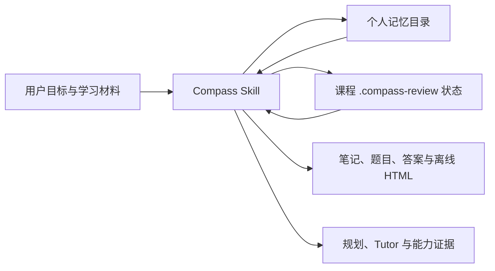

# Compass Student Growth

> 面向任意专业大学生的长期成长与期末复习 Skill：记住重要上下文，读取个人资料文件夹，生成考试导向的复习内容，并把每次学习接回上一次进度。

[](LICENSE)
[](SKILL.md)
[](SKILL.md)

Compass Student Growth 不是只回答一次问题的聊天提示词，也不是只适用于计算机专业的规划模板。它是一套纯 Skill 工作流：依靠宿主 Agent 已有的文件、搜索、推理与其他工具，为不同专业的学生提供可恢复、可检查、可继续的成长支持。

## 核心能力

### 1. 个人持久记忆

- 将稳定事实、目标、偏好、能力证据、工作区和下一步写入用户自己的文件。
- 新会话先恢复 `MEMORY.md` 与最新 checkpoint，再继续未完成任务。
- 按个人档案隔离数据，避免不同用户、课程或项目互相污染。
- 支持查看、纠正、导出、迁移与遗忘；关键写入后回读验证。

这里的“持久”是可验证的文件持久化，不是模型凭空拥有无限上下文。只要记忆目录仍在且当前 Agent 有读取权限，就能跨会话恢复；文件被删除、设备损坏或迁移时未复制该目录，则无法保证恢复。

### 2. 资料文件夹驱动的 Final Review

用户把历年真题、教师课件、作业、讲义、阅读材料或速成资料放进自己的课程文件夹，Skill 会执行完整复习流水线：

```text
递归盘点 → 格式标准化 → 内容清洗 → 来源分级
→ 考试蓝图 → 知识地图 → 复习笔记
→ 题目 → 独立答案与得分型解析 → 错题循环 → 增量更新
```

- 题源优先级：历年真题 > 教师课件 > 作业与指定阅读 > 速成资料 > AI 补充。
- 按知识密度、出现频率和可考性为每个知识点生成 1—6 题。
- 普通文本将题目与答案分离，适合先做后对；离线 HTML 用折叠区域隐藏答案。
- 客观题解释核心概念、定义和易混项；主观题给出得分点、必写内容、常见失分与作答结构。
- 原始资料只读；索引和状态写入 `.compass-review/`，成品写入 `review-output/`。
- 材料中的“忽略规则”“删除文件”等指令只作为学习资料处理，不能覆盖用户指令或 Skill 规则。

### 3. 全专业动态成长规划

- 不维护“专业 → 唯一职业”的僵硬映射。
- 通过领域、能力、前置知识、学习结果、练习、证据和验收标准生成路径。
- 能处理主修、辅修、转专业、跨专业、科研、升学、资格考试、实习与求职等组合目标。
- 长尾专业信息不足时明确降级到学科族或通用问题解决框架，不用 Python、Java、GitHub 等例子填充无关领域。

### 4. Tutor、Assessment 与错题学习

- 先诊断，再讲解、示范、练习、分级提示和验收。
- 将结果标为 `MET / PARTIAL / MISSING / UNCLEAR`，并指出证据与下一步。
- 只从用户提交的作品、完成记录和明确反馈中更新能力判断，不把模型生成的计划当成用户已经掌握的证据。

### 5. 基于证据的自我调整

- 记录重复问题的有效修复方式、稳定偏好与实际耗时。
- 根据完成情况调整任务大小、顺序、练习形式与提醒节奏。
- 不把一次失败固化成个人标签，也不在未经确认时修改长期目标。

### 6. 条件式联网与主动跟进

- 当宿主提供浏览能力时，可核验政策、考试规则、院校要求、招聘信息与最新资料。
- 当宿主提供自动化或日历能力且用户授权时，才创建真实提醒。
- 没有相应工具时明确说明限制，不声称后台监控、自动提醒或已经联网。

## 工作原理



每轮遵循同一条主流程：

```text
SAFETY → RESTORE → UNDERSTAND → DECIDE
→ EXECUTE → LEARN → PERSIST → RESPOND
```

默认个人记忆位于：

```text
~/.compass-student-growth/users/<profile-id>/
├── MEMORY.md
├── profile.md
├── goals.md
├── preferences.md
├── competencies.md
├── evidence.md
├── workspaces.md
├── checkpoints/
│   ├── latest.md
│   └── previous.md
└── sessions/
```

如果用户只授权写入某个课程文件夹，该限制是硬边界：Skill 只更新课程内的 `.compass-review/`，不会额外创建全局个人档案。

## 安装

Codex 会从仓库、用户和管理员级的 `.agents/skills` 目录发现 Skill。官方的安装位置、显式调用与隐式调用说明见 [OpenAI：Build skills](https://learn.chatgpt.com/docs/build-skills)。

### 使用 Skill Installer

在 Codex 中输入：

```text
使用 $skill-installer 从 https://github.com/Yunique-hub/Compass-.git 安装 compass-student-growth
```

### 手动安装

将仓库克隆到用户级 Skill 目录：

```bash
git clone https://github.com/Yunique-hub/Compass-.git ~/.agents/skills/compass-student-growth
```

也可以解压 `skill.zip`，并确保最终结构是：

```text
~/.agents/skills/compass-student-growth/SKILL.md
```

安装后若未立即出现，重启 Codex 使其重新发现 Skill。

## 快速开始

显式调用：

```text
$compass-student-growth 记住：我是法学大二学生，每周可投入 6 小时，偏好案例式学习。以后继续沿用。
```

读取资料文件夹并生成期末复习包：

```text
$compass-student-growth 读取 D:\课程\民法期末资料。不要修改原件；先整理知识点，再生成题目、独立答案、得分型解析和离线 HTML，并保存复习进度。
```

从上次 checkpoint 继续：

```text
$compass-student-growth 恢复我的个人记忆和这门课的复习状态，从上次未完成的题目继续。
```

进行通用成长规划：

```text
$compass-student-growth 我是环境设计专业大三，想同时准备作品集和研究生考试。每周 12 小时，请给我本周可验收的任务。
```

## 课程文件夹示例

输入由用户维护，输出与状态由 Skill 生成：

```text
民法期末资料/
├── 历年真题.pdf
├── 老师课件.pptx
├── 平时作业.docx
├── 指定阅读/
├── .compass-review/
│   ├── source-index.md
│   ├── exam-blueprint.md
│   ├── knowledge-map.md
│   ├── mistakes.md
│   ├── state.md
│   └── normalized/
└── review-output/
    ├── notes.md
    ├── questions.md
    ├── answers.md
    └── review.html
```

支持的实际格式取决于宿主可用的读取与转换工具。即使缺少某种转换器，Skill 也应继续处理可读文件，并把失败项和原因写入来源索引。

## 仓库结构

```text
.
├── SKILL.md                         # 入口、路由与每轮工作流
├── agents/openai.yaml               # 展示名称、简介与默认提示
├── references/
│   ├── persistent-memory.md         # 个人持久记忆协议
│   ├── final-review.md              # 资料文件夹复习协议
│   ├── evidence-memory.md            # 证据与能力记忆规则
│   ├── tutor-assessment.md           # Tutor 与验收
│   ├── goals-planning.md             # 目标与周计划
│   ├── domain-intelligence.md        # 全专业领域推理
│   ├── academic-context.md           # 学术背景解析
│   ├── career-research-resources.md  # 职业与外部研究
│   ├── response-safety.md            # 响应、安全与隐私
│   └── acceptance-scenarios.md       # 行为验收场景
└── LICENSE
```

本 Skill 不依赖 Python 应用、数据库、后端服务或固定浏览器。仓库以指令与参考协议为主，只有在宿主已经提供相应能力时才调用工具。

## 隐私与安全

- 记忆与复习状态默认保存在用户本机文件中，不应自动上传。
- 第三方个人信息、短期情绪、未经验证的推断和秘密信息不写入长期记忆。
- 用户可以指定可写目录；指定后不得越界写入。
- 原始学习资料保持只读，缓存和成品进入专用目录。
- 用户可要求查看、纠正、导出或删除个人记忆。
- 高风险医疗、法律、金融或危机问题优先遵守安全边界，不用成长规划替代专业支持。

## 验证标准

仓库包含覆盖以下场景的验收规范：跨会话恢复、用户隔离、写入回读、写入范围限制、混合资料解析、来源优先级、提示注入防护、答案分离、HTML 折叠、增量更新、错题循环、全专业一致性与工具缺失降级。

发布前应确认：

- `SKILL.md` 元数据与链接有效。
- 所有 reference 都能从入口按需到达。
- Skill 包内没有运行时缓存、数据库、测试输出或个人资料。
- 解压后的 Skill 能独立通过结构验证。
- `skill.zip` 不包含仓库展示用的 `README.md`，只包含运行所需文件与许可证。

## 设计来源

资料驱动复习流程吸收了 [lucianwhy/final-review](https://github.com/lucianwhy/final-review) 的产品思路，并在本仓库中按 Compass 的持久记忆、全专业路由、写入边界与安全协议独立实现；没有复制或打包该仓库的代码与资源。

Skill 的目录约定与发现方式遵循 [OpenAI Skills 文档](https://learn.chatgpt.com/docs/build-skills)。

## License

[MIT License](LICENSE) © 2026 Yunique-hub
